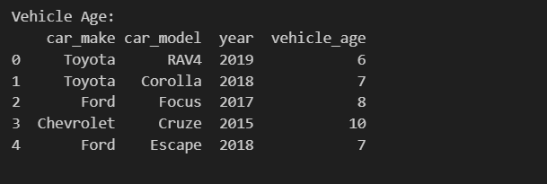
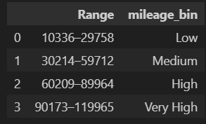

# *ETL_Extract-Snit_Teshome*  
## **DSA2040_LAB 3 – Practicing Extraction in ETL_**

---

## *Table of Contents*  
- *[Overview](#overview)*  
- *[Project Objective](#project-objective)*  
- *[Tools & Technologies](#tools--technologies)*  
- *[Repository Structure](#repository-structure)*  
- *[Notebook Description](#notebook-description)*  
  - *[LAB 3: Extraction in ETL](#lab-3-extraction-in-etl)*  
  - *[LAB 4: Transform in ETL](#lab-4-transform-in-etl)*  
  - *[LAB 5 – Load Section](#lab-5--load-section)*  
- *[Output for ETL Process](#output-for-etl-process)*  
- *[How to Reproduce](#how-to-reproduce)*  
- *[Repository URL](#repository-url)*  
- *[License](#license)*

---

## *Overview*

### *Historical Description of the Car Sales Dataset*

*This dataset represents simulated used car sales data over two months (April–May 2025). It includes purchases by major automotive dealers, rental companies, and vehicle auction services such as AutoNation, CarMax, Enterprise Holdings, and Manheim.*

*The dataset features popular car brands like Toyota, Honda, Ford, Hyundai, and Chevrolet, with model years ranging from 2015 to 2023. It records key details such as vehicle age, mileage, price, and payment types, offering a realistic view of market diversity and buyer preferences.*

#### *Key Attributes*

- *Date of Sale:* *The date on which the car transaction occurred, showing when the vehicle was purchased.*  
- *Dealer:* *Represents the company or automotive group that sold or distributed the vehicle.*  
- *Car Make and Model:* *Describes the manufacturer (e.g., Toyota, Ford) and specific model of the vehicle, indicating brand preference and market variety.*  
- *Manufacture Year:* *Indicates the year the vehicle was made, providing context for its age and potential value depreciation.*  
- *Odometer Reading:* *Shows the total distance the vehicle had traveled before the sale, an important factor influencing its condition and price.*  
- *Sale Price:* *The amount (in USD) for which the vehicle was sold, indicating market demand and valuation.*  
- *Payment Method:* *Specifies how the transaction was completed—via cash, credit, or loan—reflecting diverse financing choices.*  
- *Last Updated:* *The timestamp of the most recent update to the record, helping track edits or corrections.*

---

## *Project Objective*

## *Project Objective*

- _Generate sample **car sales data** spanning multiple days._
- _Implement a **full extraction** process to load all available records._
- _Implement an **incremental extraction** process that pulls only new or updated data since the last extraction timestamp._
- _Maintain and update a **checkpoint file** to track the last successful extraction time._
- _Apply at least **three transformation techniques** (e.g., column cleanup, date formatting, and derived metrics) to both full and incremental datasets to prepare them for analysis._
- _Load transformed car sales records into a structured and efficient storage format._
- _Convert CSV files into **Parquet format** using Python to optimize for fast access, reduced storage size, and seamless integration into analytical workflows and data platforms.


---

## *Tools & Technologies*
- *Python*  
- *pandas*  
- *NumPy*  
- *datetime*
- *random*
- *Jupyter Notebook*  

---

## *Repository Structure*

```plaintext
ETL_Extract_Snit_Teshome/
├── etl_extract.ipynb                        # Jupyter Notebook with ETL implementation
├── car_sales_data_may_2025.csv             # Dataset file
├── Out_put_Extraction/                     # Folder for extraction outputs
│   ├── car_sales_full_extraction_output.csv          # Output of full extraction (saved CSV)
│   ├── car_sales_incremental_extraction_output.csv    # Output of incremental extraction (saved CSV)
├── last_extraction.txt                     # Timestamp for incremental extraction
├── Out_put_Transformaion/                     # Folder for extraction outputs
│   ├── transformed_full_output.csv          # Output of full extraction (saved CSV)
│   ├──transformed_incremental.csv.csv
├── etl_load.ipynb              #Notebook focuses on loading.     
├── loaded_data/                     # Folder for extraction outputs
│   ├── full_data.parquet         # Output of full extraction (saved CSV)
│   ├──incremental_data.parquet
├── README.md                               # Project documentation
└── .gitignore                              # Git ignore file

```
---
 *`04_last_extraction.txt` is tracked once and then ignored using `.gitignore` and `git update-index` to prevent unnecessary commits while keeping it in the repo.*

---
## *Notebook Description*
### *LAB 3: Extraction in ETL*

_This project includes two main Jupyter Notebooks that demonstrate ETL (Extract, Transform, Load) techniques:_

- _**`etl_extract.ipynb`** – Handles data generation, full and incremental extraction, and transformation._
- _**`etl_load.ipynb`** – Loads the transformed datasets into Parquet format for efficient storage and future analysis._

---

### *`etl_extract.ipynb` Structure Overview*

#### *STEP 1: Generate Synthetic Data*
_This step creates a sample car sales dataset (`car_sales_data_may_2025.csv`) with features like `car_make`, `model`, `price`, `mileage`, and `last_updated`._

---

### *Section 1: Full Extraction*
- _The entire dataset is read from the source `car_sales_data_may_2025.csv`._
- _All records, regardless of whether they are new or unchanged, are loaded into memory._
- _Basic info (row/column counts and a data preview) is displayed for verification._

---

### *Section 2: Incremental Extraction*
- _Reads the last extraction timestamp from `last_extraction.txt`._
- _Parses the `last_updated` column as datetime to enable time-based filtering._
- _Converts the timestamp into a pandas datetime object for precise comparison._
- _Filters the dataset to include only records updated **after** the last extraction._
- _Displays the filtered incremental data to verify correct extraction._

---

### *Update `last_extraction.txt`*
- _The timestamp file is updated with the latest extraction time to support the next incremental run._

---

## *LAB 4: Transform in ETL*

### *Transformation Overview (applied to both full and incremental extractions)*

#### *String-Based Missing Value Handling*
- _Missing values in columns like `customer` and `payment_type` are filled with `"Unknown"` to standardize the dataset._

#### *Group-wise Imputation for `mileage`*
- _Missing `mileage` values are imputed using the **mean mileage per car make and model**._

#### *Categorizing Mileage*
- _`mileage` values are binned into categories: `Low`, `Medium`, `High`, and `Very High` for simplified analysis._
#### *Group-based Imputation for `price`*
- _Missing `price` values are filled using the **mean price within each group** defined by `car_make`, `car_model`, and `mileage_bin`._
---

### *Feature Enrichment*

#### *Derived Column: `vehicle_age`*
- _Calculated from the current year minus `year` to represent the car's age numerically._

#### *Adding a Surrogate Key: `sales_id`*
- _A new column `sales_id` is introduced to uniquely identify each record._
- _The original `id` column is dropped, and `sales_id` is added as the first column._
- _This improves data integrity, traceability, and integration with external systems._

---

*These transformations ensure that both the full and incremental datasets are clean, enriched, and structured for efficient loading and analysis.*


## *Lab 5 – Load Section*

_In this section, the transformed car sales records were loaded and saved in an optimized format for storage and future analysis._

## *Loading Method Used*  
_The data was loaded using Python's `pandas` library. The transformed CSV files were read and then converted to Parquet format, which offers efficient storage and is well-suited for analytical workflows._

## *Data Files Processed* 
- _`transformed_full.csv` was converted to `full_data.parquet`._  
- _`transformed_incremental.csv` was converted to `incremental_data.parquet`._
## *Sample Code*

```python
import pandas as pd

# Full transformed data
full_df = pd.read_csv("transformed_full.csv")
full_df.to_parquet("full_data.parquet", index=False)

# Incremental transformed data
incremental_df = pd.read_csv("transformed_incremental.csv")
incremental_df.to_parquet("incremental_data.parquet", index=False)

# Verifying the Parquet files
pd.read_parquet("full_data.parquet").head()
pd.read_parquet("incremental_data.parquet").head()
```
# *Output for ETL process*
## *Output Location for Loading*

_The output files were saved in Parquet format within the current repository directory. These files are ready to be used for downstream analytics, integration into data platforms, or long-term storage alongside this project._

- _`full_data.parquet`_  
- _`incremental_data.parquet`_

# *Output for Extraction*
### *Full Extraction*

### *Incremental Extraction*


## *Output for Transformation*

## 1.*Data_cleaning*


## 2. *Categorize mileage*


## 3. *Enrichment* 


## 4. *Key Restructuring*


## *How to Reproduce*

1. _Clone the repository from GitHub to your local machine._
2. _Ensure that the dataset file:_ `car_sales_data_may_2025.csv` _is located in the project directory._
3. _Open the Jupyter Notebook:_ `etl_extract.ipynb`
   - _Run the cells step-by-step to perform both **Full Extraction** and **Incremental Extraction**._
   - _Apply **transformation techniques** to both full and incremental datasets within the same notebook._
   - _Track incremental changes using:_ `last_extraction.txt`
   - _Save extracted and transformed outputs to:_
     - _`Out_put_Extraction/`_ (raw extracted data as csv)
     - _`Out_put_Transformaion/`_ (cleaned/transformed data)
4. _Open the notebook:_ `etl_load.ipynb`
   - _Load the transformed datasets (`transformed_full.csv`, `transformed_incremental.csv`) into efficient Parquet format._
   - _Saved output files:_
     - _`loaded_data/full_data.parquet`_
     - _`loaded_data/incremental_data.parquet`_
5. _Verify loaded data using `.head()` in the notebook to preview both datasets._
6. _Commit and push your updated files and notebooks to GitHub to preserve changes and progress._

## *Repository URL*

[https://github.com/SnitTeshome/ETL_Extract-Snit_Teshome](https://github.com/SnitTeshome/ETL_Extract-Snit_Teshome)

## *License*

This project is licensed under the [MIT License](https://github.com/SnitTeshome/ETL_Extract-Snit_Teshome?tab=MIT-1-ov-file).

© 2025 Snit Kahsay Teshome